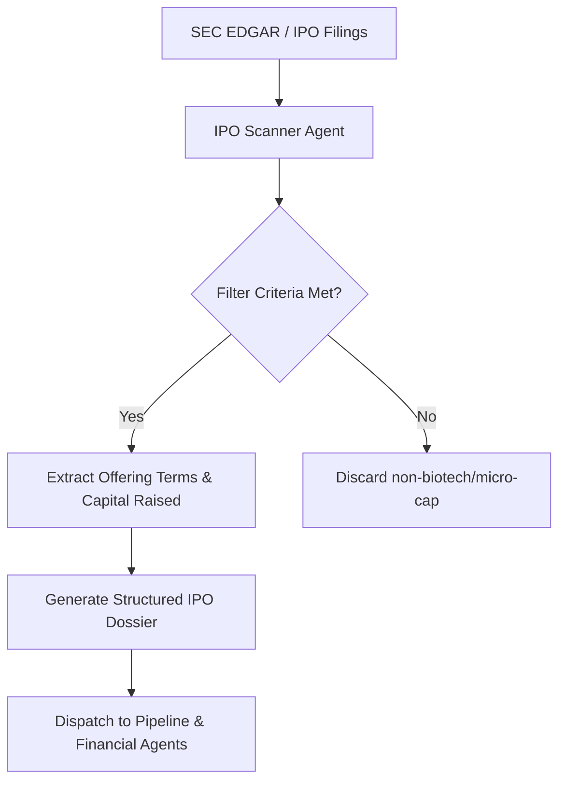

# Agent 1: IPO Scanner & Discovery Agent (`ipo_scanner_agent`)

## 🎯 Role Overview
The **IPO Scanner & Discovery Agent** is the primary intake module of the Biotech Investment Intelligence Pipeline. It continuously monitors regulatory filings, SEC Form S-1/S-1A submissions, preliminary prospectuses, and IPO calendars to identify upcoming and recent biotechnology initial public offerings (2024–2026).

---

## 📋 Core Responsibilities & Scope
1. **Filing Detection & Verification**: Scan SEC EDGAR, NASDAQ, and NYSE listing filings for biotechnology (SIC Code 2834 / 2836) candidates.
2. **Offering Structure Analysis**: Extract key financial terms of the IPO:
   - File Price Range & Final IPO Offer Price.
   - Total Shares Offered & Greenshoe Option (Over-allotment).
   - Gross & Net Expected Proceeds.
   - Lead Underwriters & Syndicate (e.g., J.P. Morgan, Jefferies, Morgan Stanley, Leerink Partners).
3. **Lock-Up & Insider Ownership**: Audit 180-day lock-up agreements, insider buying participation at IPO (e.g., existing venture capital backing), and float concentration.
4. **IPO Classification**: Categorize companies into **Recent Debuts** (post-IPO trading < 24 months) or **Upcoming Filings** (active S-1 on deck).

---

## ⚙️ Standard Operating Procedure (SOP)



### Filtering Criteria:
- **Sector**: Human Therapeutics, Gene Editing, Radiopharmaceuticals, Oncology, Immunology, Metabolic Diseases.
- **Minimum Raise**: $\ge \$50\text{ Million}$ (excludes penny-stock shell IPOs).
- **Listing Exchange**: NASDAQ Global Select / Global Market, NYSE.

---

## 📊 Standard Output Schema (JSON & Markdown)

```json
{
  "company_name": "Kailera Therapeutics",
  "ticker": "KLRA",
  "ipo_date": "2026-04",
  "ipo_status": "Recent IPO",
  "offer_price": 20.00,
  "gross_proceeds_usd_m": 625.0,
  "lead_underwriters": ["Bain Capital", "Jefferies", "Morgan Stanley"],
  "insider_participation_pct": 45.0,
  "lockup_expiry_days": 180,
  "pre_ipo_vcs": ["Bain Capital Life Sciences", "Atlas Venture", "RTW Investments"]
}
```

---

## 🔍 Quality Assurance & Guardrails
- **No OTC / Micro-cap Noise**: Excludes OTC-bulletin-board shell companies.
- **Accurate Historical Tracking**: Cross-checks IPO offering price against current market trading prices to calculate percentage gain/loss since debut.
