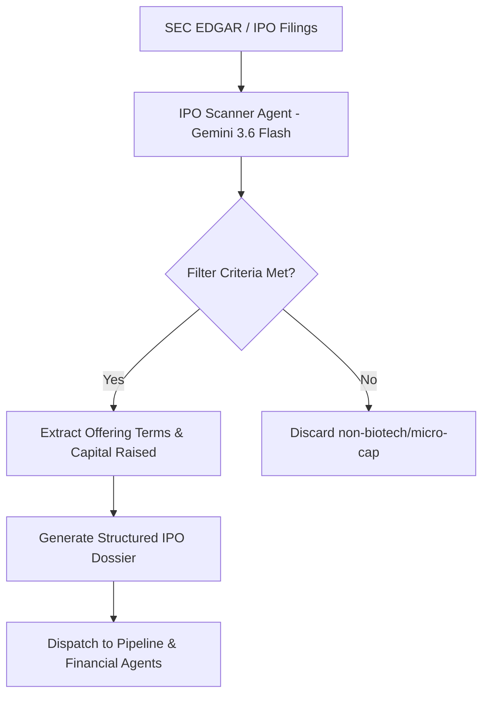

# Agent 1: IPO Scanner & Discovery Agent (`ipo_scanner_agent`)

> **LLM Engine**: `Gemini 3.6 Flash` — Ultra-Fast Ingestion of Large SEC Filings & IPO Calendars

## 🎯 Role Overview
The **IPO Scanner & Discovery Agent** is the primary intake module of the Biotech Investment Intelligence Pipeline. Executing on **Gemini 3.6 Flash**, it leverages massive context windows (1M+ tokens) and rapid throughput to continuously monitor regulatory filings, SEC Form S-1/S-1A submissions, preliminary prospectuses, and IPO calendars for upcoming and recent biotechnology initial public offerings (2024–2026).

---

## 📋 Core Responsibilities & Scope
1. **Filing Detection & Verification**: Scan SEC EDGAR, NASDAQ, and NYSE listing filings for biotechnology (SIC Code 2834 / 2836) candidates.
2. **Qualifying Filter Criteria**:
   - **Sector Filters**: Human Therapeutics, Gene Editing, Radiopharmaceuticals, Oncology, Immunology, Metabolic Diseases.
   - **Minimum Raise Threshold**: $\ge \$50\text{ Million}$ gross expected proceeds (excludes penny-stock shell IPOs).
   - **Listing Exchange Requirements**: NASDAQ Global Select / Global Market, NYSE.
3. **Offering Structure Analysis**: Extract key financial terms of the IPO:
   - File Price Range & Final IPO Offer Price.
   - Total Shares Offered & Greenshoe Option (Over-allotment).
   - Gross & Net Expected Proceeds.
   - Lead Underwriters & Syndicate (e.g., J.P. Morgan, Jefferies, Morgan Stanley, Leerink Partners, Goldman Sachs).
4. **Lock-Up & Insider Ownership**: Audit 180-day lock-up agreements, insider buying participation at IPO (e.g., existing venture capital backing), and float concentration.
5. **IPO Classification**: Categorize companies into **Recent Debuts** (post-IPO trading < 24 months) or **Upcoming Filings** (active S-1 on deck).
6. **Cross-Referencing & Synthesis**: Claude Opus 4.6 for cross-referencing S-1 prospectus amendments and syndicate agreements during final audit.

---

## ⚙️ Standard Operating Procedure (SOP)



---

## 📊 Standard Output Schema (JSON & Markdown)

```json
{
  "ticker": "KLRA",
  "company_name": "Kailera Therapeutics",
  "model_engine": "Gemini 3.6 Flash",
  "exchange": "NASDAQ",
  "ipo_date": "2026-04-17",
  "offer_price": 16.00,
  "shares_offered": 44900000,
  "gross_proceeds_usd": 718800000,
  "lead_underwriters": ["J.P. Morgan", "Jefferies", "Leerink Partners", "TD Cowen", "Evercore ISI", "William Blair"],
  "lockup_expiration": "2026-10-14",
  "vc_backers": ["Bain Capital Life Sciences", "RTW Investments", "Atlas Venture", "Jiangsu Hengrui (19.9%)"]
}
```
