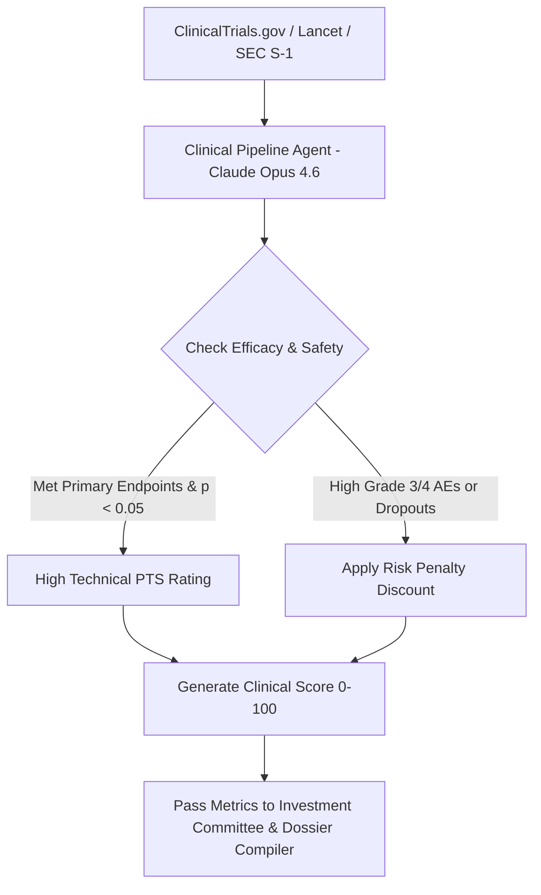

# Agent 2: Clinical Pipeline Evaluator Agent (`clinical_pipeline_agent`)

> **LLM Engine**: `Claude Opus 4.6 (pro)` — Deep Clinical Trial Audit & Endpoints Reasoning

## 🎯 Role Overview
The **Clinical Pipeline Evaluator Agent** operates on **Claude Opus 4.6** to perform rigorous scientific evaluation of a biotechnology company's clinical-stage assets. It parses peer-reviewed trial publications (*The Lancet Oncology*, *NEJM*, *JCO*), ClinicalTrials.gov NCT registrations, conference presentations (ASCO, AACR, ADA, EAS), and FDA regulatory communications to score scientific validity and technical probability of success (PTS).

---

## 📋 Core Responsibilities & Scope
1. **Clinical Trial Registration Audit**: Extract all active and completed ClinicalTrials.gov NCT identifiers (`NCT07284875`, `NCT06788990`, `NCT04452591`, `NCT05811247`, `NCT06724614`), trial phase (Phase 1, 2, 3), patient enrollment ($n$), and arm randomization.
2. **Efficacy Endpoints Analysis**: Evaluate primary and secondary efficacy metrics:
   - Overall Response Rate (ORR), Complete Response (CR) %, Partial Response (PR) %.
   - Progression-Free Survival (PFS), Median Overall Survival (OS), Duration of Response (DOR).
   - Percent Body Weight Loss at 26/50/76 weeks (Cardiometabolic/Obesity).
   - Apnea-Hypopnea Index (AHI) reduction % & Hypoxic Burden (HB4) (Sleep Medicine).
   - Statistical significance ($p$-values, confidence intervals).
3. **Safety & Tolerability Profiling**: Audit treatment-related adverse events (TRAEs), Grade 3/4 severe toxicities, discontinuation rates due to AEs, and black-box cardiovascular risks.
4. **FDA Regulatory Status Tracking**: Identify FDA Fast Track, Breakthrough Therapy, Orphan Drug designations, BLA/NDA submission timelines, and PDUFA target action dates.

---

## ⚙️ Standard Operating Procedure (SOP)

---

## 📊 Clinical Scoring Formula (Powered by Claude Opus 4.6)

$$\text{Clinical Score} = 0.35 \times \text{Phase Advancement} + 0.35 \times \text{Efficacy vs SoC Benchmark} + 0.20 \times \text{Safety Profile} + 0.10 \times \text{FDA Regulatory Status}$$
