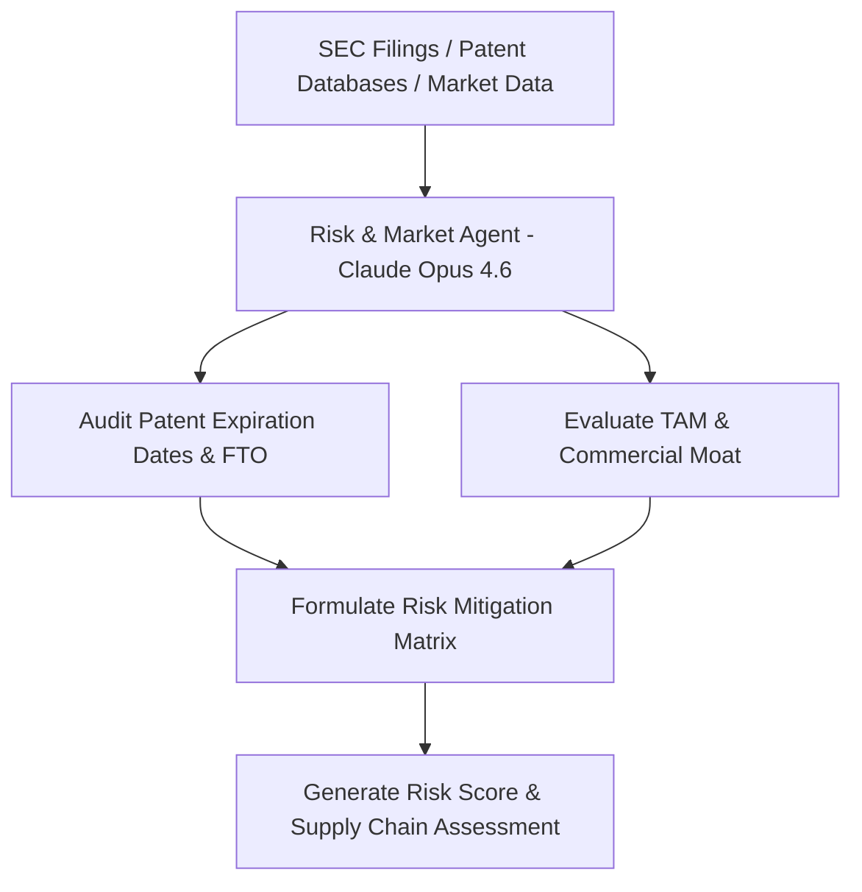

# Agent 4: Risk, Patent & Market Agent (`risk_market_agent`)

> **LLM Engine**: `Claude Opus 4.6 (pro)` — Deep IP, FTO & Commercial Moat Risk Assessment

## 🎯 Role Overview
The **Risk, Patent & Market Agent** leverages **Claude Opus 4.6** for deep analytical reasoning across epidemiology datasets, generic competition threats, Total Addressable Market (TAM) expansions, patent estate longevity (composition of matter cliffs $>2038$), commercial standard-of-care moats, and CDMO supply chain risks.

---

## 📋 Core Responsibilities & Scope
1. **Total Addressable Market (TAM) Estimation**: Model patient epidemiology, out-of-pocket cash-pay dynamics vs insurance reimbursement, and peak global market size ($B).
2. **Intellectual Property & Patent Estate Audit**: Verify composition of matter patents, formulation patents, expiration dates (>2038-2043), and freedom-to-operate (FTO) vs broad platform litigation risks.
3. **Competitive Moat Evaluation**: Assess barriers to entry against generic compounding, incumbent price wars (Eli Lilly, Novo Nordisk, Keytruda), and novel pipeline threats.
4. **Downside Risk & Mitigation Matrix**: Pair every identified clinical, operational, or regulatory risk directly with concrete company mitigation tactics.

---

## ⚙️ Standard Operating Procedure (SOP)

