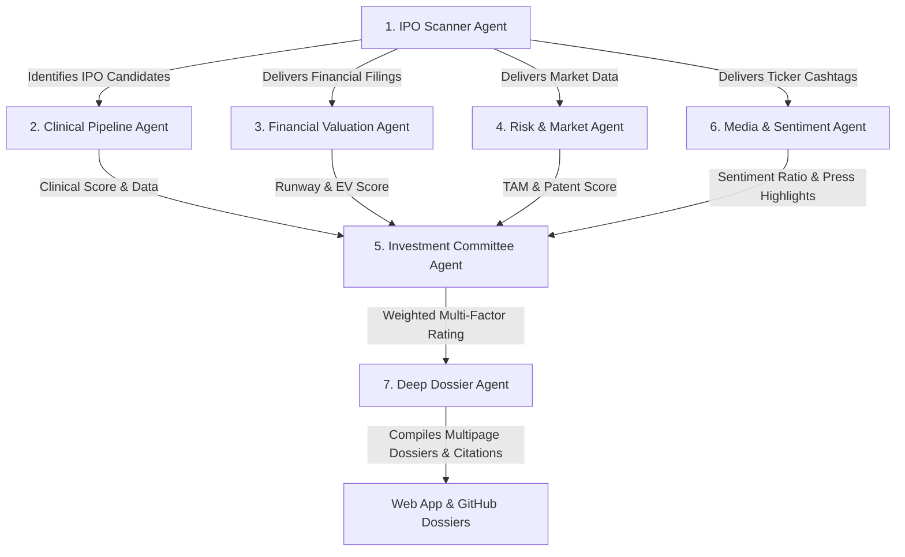

# 🧬 Multi-Agent System Architecture for Biotech IPO Intelligence `v1.0.0`

This directory contains the formal markdown specifications and execution rules for the 7 autonomous agents designed to evaluate biotechnology companies with recent or upcoming Initial Public Offerings (IPOs).

---

## 🤖 Agent Roster

| Agent File | Role | Focus Area | Key Output Metric |
| :--- | :--- | :--- | :--- |
| [`01_ipo_scanner_agent.md`](file:///home/ACT/Downloads/Biotechnology/agents/01_ipo_scanner_agent.md) | **IPO Scanner** | Filings (S-1), IPO proceeds, Syndicate, Lock-ups | Target list, Gross raise, Lock-up date |
| [`02_clinical_pipeline_agent.md`](file:///home/ACT/Downloads/Biotechnology/agents/02_clinical_pipeline_agent.md) | **Clinical Evaluator** | Phase, MoA, Efficacy endpoints, Safety (AEs), FDA status | Clinical Score (0–100) |
| [`03_financial_valuation_agent.md`](file:///home/ACT/Downloads/Biotechnology/agents/03_financial_valuation_agent.md) | **Financial Analyst** | Cash runway, Burn rate, Enterprise Value, Dilution risk | Financial Score & Implied Runway |
| [`04_risk_market_agent.md`](file:///home/ACT/Downloads/Biotechnology/agents/04_risk_market_agent.md) | **Risk & Market Specialist** | TAM, Competition, Patent expiration, FTO, Manufacturing | Risk Matrix Rating & Score |
| [`05_investment_committee_agent.md`](file:///home/ACT/Downloads/Biotechnology/agents/05_investment_committee_agent.md) | **Investment Committee** | Synthesis of all sub-agent scores into final rating | Rating (**Strong Buy**, **Speculative Buy**, **Hold**, **Avoid**) |
| [`06_media_sentiment_agent.md`](file:///home/ACT/Downloads/Biotechnology/agents/06_media_sentiment_agent.md) | **Media & Sentiment Monitor** | Press (Lancet, BioSpace), Twitter/X, Reddit, Insider trading | Sentiment Score & Bullish/Bearish Ratio |
| [`07_deep_dossier_agent.md`](file:///home/ACT/Downloads/Biotechnology/agents/07_deep_dossier_agent.md) | **Deep Dossier Compiler** | Executive profiles, NCT trials, Bull/Bear cases, Citations | Comprehensive Multi-Page Company Dossier |

---

## 🔄 Workflow Diagram

