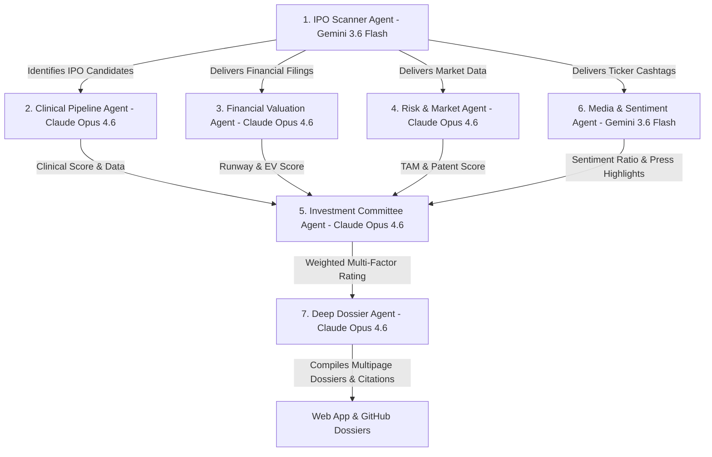

# 🧬 Multi-Agent System Architecture for Biotech IPO Intelligence `v2.5`

This directory contains the formal markdown specifications and execution rules for the 7 autonomous agents designed to evaluate biotechnology companies with recent or upcoming Initial Public Offerings (IPOs).

> **Hybrid LLM Architecture**: We utilize a hybrid, task-optimized model strategy — pairing high-speed, large-context agents (**Gemini 3.6 Flash**) for web scraping, SEC filing intake, and media audits with deep reasoning models (**Claude Opus 4.6**) for clinical evaluation, financial rNPV modeling, risk/patent auditing, decision-making, and memo compilation.

---

## 🤖 Agent Roster & Hybrid LLM Engine Configuration

| Agent File | Role | Optimized LLM Engine | Focus Area | Key Output Metric |
| :--- | :--- | :--- | :--- | :--- |
| [`01_ipo_scanner_agent.md`](./01_ipo_scanner_agent.md) | **IPO Scanner** | `Gemini 3.6 Flash` | Filings (S-1), IPO proceeds, Syndicate, Lock-ups | Target list, Gross raise, Lock-up date |
| [`02_clinical_pipeline_agent.md`](./02_clinical_pipeline_agent.md) | **Clinical Evaluator** | `Claude Opus 4.6` | Phase, MoA, Efficacy endpoints, Safety (AEs), FDA status | Clinical Score (0–100) |
| [`03_financial_valuation_agent.md`](./03_financial_valuation_agent.md) | **Financial Analyst** | `Claude Opus 4.6` | Cash runway, Burn rate, Enterprise Value, Dilution risk | Financial Score & Implied Runway |
| [`04_risk_market_agent.md`](./04_risk_market_agent.md) | **Risk & Market Specialist** | `Claude Opus 4.6` | TAM, Competition, Patent expiration, FTO, Manufacturing | Risk Matrix Rating & Score |
| [`05_investment_committee_agent.md`](./05_investment_committee_agent.md) | **Investment Committee** | `Claude Opus 4.6` | Synthesis of all sub-agent scores into final rating | Rating (**Strong Buy**, **Speculative Buy**, **Hold**, **Avoid**) |
| [`06_media_sentiment_agent.md`](./06_media_sentiment_agent.md) | **Media & Sentiment Monitor** | `Gemini 3.6 Flash` | Press (Lancet, BioSpace), Twitter/X, Reddit, Insider trading | Sentiment Score & Bullish/Bearish Ratio |
| [`07_deep_dossier_agent.md`](./07_deep_dossier_agent.md) | **Deep Dossier Compiler** | `Claude Opus 4.6` | Executive profiles, NCT trials, Bull/Bear cases, Citations | Comprehensive Multi-Page Company Dossier |

---

## 🔄 Workflow Diagram

